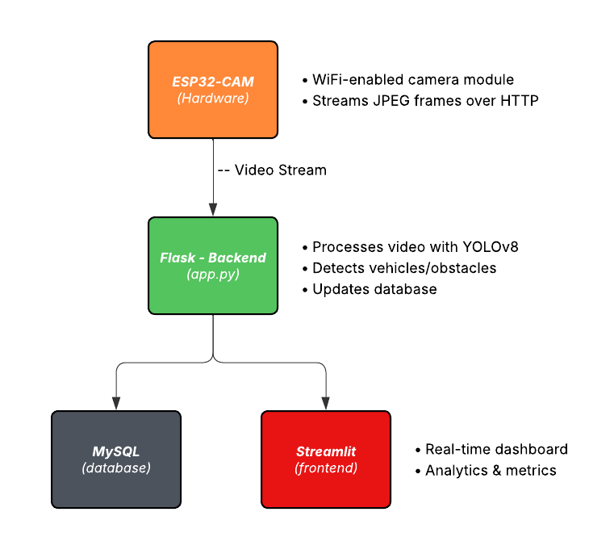

# IoT Smart Parking Lot Management System

## Overview

This IoT project is an intelligent parking lot management system that combines computer vision, machine learning, and IoT hardware to monitor and manage parking spaces in real-time. The system uses an **ESP32-CAM** module to stream live video, processes the feed with a custom-trained YOLOv8 object detection model to identify vehicles (toy cars) and obstacles (rocks), and provides a web dashboard for real-time monitoring and historical analytics.

---

## Features

- **Real-time Parking Detection** - Monitors 8 parking spaces (A1-A8) simultaneously  
- **AI-Powered Recognition** - YOLOv8 model trained to detect cars and obstacles  
- **Live Video Stream** - ESP32-CAM provides real-time video feed processing  
- **Web Dashboard** - Beautiful Streamlit interface with real-time updates  
- **Historical Analytics** - Peak hours analysis with customizable date ranges  
- **Database Logging** - MySQL database tracks all parking events with timestamps  
- **Occupancy Metrics** - Duration tracking, availability rate, and statistics  
- **Multi-Status Detection** - Distinguishes between available, occupied, and obstacle states

---

## System Architecture



---

## Hardware Requirements

### ESP32-CAM Freenove ESP32 WROVER

You will need an **ESP32-CAM** development board with the following specifications:
- OV2640 camera sensor
- WiFi capability (2.4GHz)
- 4MB flash memory minimum
- FTDI programmer or USB-to-TTL adapter (for initial upload)

---

## Software Requirements

- **Python**
- **MySQL Server**
- **Arduino IDE** (for ESP32-CAM setup)

### System Dependencies

The project requires these key Python packages:
- Flask (backend web server)
- OpenCV (computer vision)
- Ultralytics (YOLOv8 implementation)
- PyTorch (deep learning framework)
- Streamlit (dashboard frontend)
- MySQL Connector (database interface)
- python-dotenv (environment configuration)

---

## Installation

### 1. Hardware Setup (ESP32-CAM)

#### Step 1.1: Install Arduino IDE
1. Download and install [Arduino IDE](https://www.arduino.cc/en/software)
2. Add ESP32 board support:
   - Go to **Tools → Board → Boards Manager**
   - Search for "esp32" and install "ESP32 by Espressif Systems"

#### Step 1.2: Upload ESP32-CAM Code
1. Open `hardware/esp32cam_setup/esp32cam_setup.ino` in Arduino IDE
2. **Important**: Update WiFi credentials in the code:
   ```cpp
   const char* WIFI_SSID = "YOUR_WIFI_NAME";
   const char* WIFI_PASS = "YOUR_WIFI_PASSWORD";
   ```
3. Select board: **Tools → Board → ESP32 Arduino → ESP32 Wrover Module**
4. Select correct COM port and click **Upload**
5. Open Serial Monitor (115200 baud) to see the IP address

The ESP32-CAM will display its stream URL in the format:
```
Stream URL: http://X.X.X.X/stream
```
**Save this URL** - you'll need it for backend configuration.

---

### 2. Database Setup

#### Step 2.1: Install MySQL
Download and install [MySQL Community Server](https://dev.mysql.com/downloads/mysql/)

#### Step 2.2: Create Database
Open MySQL command line or workbench and run:

```sql
CREATE DATABASE parking_system;
USE parking_system;

-- 1. Create ParkingLot table (no dependencies)
CREATE TABLE ParkingLot (
   ParkingLotID VARCHAR(50) PRIMARY KEY,
   Location VARCHAR(255) NOT NULL,
   NumSections INT NOT NULL
);

-- 2. Create LotSection table (depends on ParkingLot)
CREATE TABLE LotSection (
   SectionID VARCHAR(50) PRIMARY KEY,
   ParkingLotID VARCHAR(50) NOT NULL,
   Name VARCHAR(100) NOT NULL,
   NumSpaces INT NOT NULL,
   FOREIGN KEY (ParkingLotID) REFERENCES ParkingLot(ParkingLotID)
);

-- 3. Create ParkingSpace table (depends on LotSection)
CREATE TABLE ParkingSpace (
   ParkingSpaceID VARCHAR(50) PRIMARY KEY,
   SectionID VARCHAR(50) NOT NULL,
   SpaceCode VARCHAR(20) NOT NULL UNIQUE,
   Status VARCHAR(20) NOT NULL DEFAULT 'Available',
   CurrentOccupancyID VARCHAR(50) NULL,
   FOREIGN KEY (SectionID) REFERENCES LotSection(SectionID)
);

-- 4. Create OccupancyHistory table (depends on ParkingSpace)
CREATE TABLE OccupancyHistory (
   OccupancyID VARCHAR(50) PRIMARY KEY,
   ParkingSpaceID VARCHAR(50) NOT NULL,
   TimeOfEntry TIMESTAMP NOT NULL,
   TimeOfDeparture TIMESTAMP NULL,
   CheckIfObjectIsCar BOOLEAN,
   DurationMinutes INT NULL,
   FOREIGN KEY (ParkingSpaceID) REFERENCES ParkingSpace(ParkingSpaceID),
   INDEX idx_space_time (ParkingSpaceID, TimeOfEntry)
);

-- 5. Add foreign key constraint back to ParkingSpace
ALTER TABLE ParkingSpace
ADD CONSTRAINT fk_current_occupancy 
FOREIGN KEY (CurrentOccupancyID) REFERENCES OccupancyHistory(OccupancyID);

-- 6. Insert sample data
INSERT INTO ParkingLot (ParkingLotID, Location, NumSections)
VALUES ('plazaIglesias', 'Juriquilla', 1);

INSERT INTO LotSection (SectionID, ParkingLotID, Name, NumSpaces)
VALUES ('SEC-A', 'plazaIglesias', 'Seccion A', 8);

-- Insert individual parking spaces
INSERT INTO ParkingSpace (ParkingSpaceID, SectionID, SpaceCode, Status)
VALUES 
('PS-A1', 'SEC-A', 'A1', 'Available'),
('PS-A2', 'SEC-A', 'A2', 'Available'),
('PS-A3', 'SEC-A', 'A3', 'Available'),...
```

**Note**: The sample data creates 8 parking spaces by default. Adjust the `NumSpaces` value in the `LotSection` INSERT statement and add/remove parking space rows in the `ParkingSpace` INSERT statement based on your actual number of parking spaces.

---

### 3. Backend Setup

#### Step 3.1: Clone or Download Repository

```bash
git clone <this-repository-url>
```

#### Step 3.2: Create Virtual Environment

On Windows:
```bash
python -m venv .venv
.venv\Scripts\activate
```

On macOS/Linux:
```bash
python3 -m venv .venv
source .venv/bin/activate
```

#### Step 3.3: Install Dependencies

```bash
pip install -r requirements.txt
```

#### Step 3.4: Configure Environment Variables

Create a `.env` file in the project root:

```env
# ESP32-CAM Configuration
ESP32_IP=X.X.X.X
ESP32_STREAM_URL=http://{IP}/stream

# Database Configuration
DB_HOST=localhost
DB_PORT=3306
DB_USER=root
DB_PASSWORD=your_mysql_password
DB_NAME=personalized_name
```

Replace the values with your actual ESP32-CAM IP address and MySQL credentials.

---

### 4. Frontend Setup

No additional setup required. The frontend uses the same `.env` configuration as the backend.

---

## Configuration

### Calibrating Parking Zones

The system comes pre-configured with 8 parking zones, but you can adjust them:

1. Run the calibration tool:
   ```bash
   python backend/calibrate_zones.py
   ```

2. Click and drag on the video feed to draw parking zones
3. Press 's' to see the coordinates
4. Press 'q' to quit

5. Copy the output coordinates and update `PARKING_ZONES` in `backend/app.py`:
   ```python
   PARKING_ZONES = [
       [x1, y1, x2, y2, 'A1'],
       [x1, y1, x2, y2, 'A2'],
       # ... add more zones
   ]
   ```

---

## Usage

### Starting the System

You need to run **two separate processes**:

#### Terminal 1: Start Backend (Detection & API)

```bash
# Activate virtual environment
.venv\Scripts\activate  # Windows
source .venv/bin/activate  # macOS/Linux

# Run backend
python backend/app.py
```

The backend will:
- Connect to ESP32-CAM video stream
- Run YOLOv8 detection on each frame
- Update database with parking events
- Serve video feed at `http://localhost:5000`

#### Terminal 2: Start Frontend (Dashboard)

```bash
# Activate virtual environment (in new terminal)
.venv\Scripts\activate  # Windows
source .venv/bin/activate  # macOS/Linux

# Run frontend
streamlit run frontend/Home.py
```

The dashboard will open automatically at `http://localhost:8501`

### Accessing the System

- **Backend Video Feed**: http://localhost:5000
- **Frontend Dashboard**: http://localhost:8501

The dashboard displays:
- Real-time parking space status (green = available, red = occupied, orange = obstacle)
- Current occupancy statistics
- Peak hours analysis with historical data
- Customizable date range analytics

---

## Project Structure

```
Proyecto-IoT/
│
├── backend/
│   ├── app.py                      # Main Flask backend with YOLO detection
│   ├── database.py                 # MySQL database operations
│   ├── calibrate_zones.py          # Tool to calibrate parking zones
│   │
│   └── ml_model/
│       ├── train_yolo_model.py     # Script to train YOLOv8 model
│       ├── parking-dataset/        # Training dataset
│       │   ├── data.yaml           # Dataset configuration
│       │   ├── images/             # Training and validation images
│       │   └── labels/             # YOLO format annotations
│       │
│       └── runs/detect/parking_detector/
│           └── weights/
│               └── best.pt         # Trained model weights (4.8 MB)
│
├── frontend/
│   └── Home.py                     # Streamlit dashboard application
│
├── hardware/
│   └── esp32cam_setup/
│       └── esp32cam_setup.ino      # Arduino code for ESP32-CAM
│
├── requirements.txt                # Python dependencies
├── .env                            # Environment configuration (create this)
└── README.md                       # This file
```

---

## Machine Learning Model

### Pre-trained Model

The system includes a **custom-trained YOLOv8 nano model** specifically optimized for parking lot detection:
- **Model**: YOLOv8n (nano)
- **Classes**: 2 (car, obstacle)
- **Training Images**: 181 labeled images
- **Image Size**: 320x320 (optimized for ESP32-CAM QVGA resolution)
- **Model File**: `backend/ml_model/runs/detect/parking_detector/weights/best.pt`

### Retraining the Model (Optional)

If you want to improve detection or add more training data:

1. Add images to `backend/ml_model/parking-dataset/images/train/`
2. Add corresponding YOLO labels to `backend/ml_model/parking-dataset/labels/train/`
3. Update `data.yaml` with correct absolute paths
4. Run training:
   ```bash
   python backend/ml_model/train_yolo_model.py
   ```

Training will take 1-3 hours on CPU or 10-30 minutes on GPU. The model will automatically save to the `runs/detect/parking_detector/` directory.

### Model Performance

Current model metrics:
- **Precision**: Detects vehicles with high accuracy
- **Recall**: Identifies most occupied spaces correctly
- **Speed**: ~30-50ms inference time per frame on CPU
- **Optimization**: Processes every 3rd frame for better performance

---

## Troubleshooting

### ESP32-CAM Issues

**Problem**: Can't connect to ESP32-CAM stream
- **Solution**: Check that ESP32-CAM is powered on and connected to WiFi
- **Solution**: Verify the IP address in `.env` matches the Serial Monitor output
- **Solution**: Ensure your computer and ESP32-CAM are on the same network

**Problem**: Upload failed / COM port not detected
- **Solution**: Try a different USB cable or FTDI programmer
- **Solution**: Install CP210x or CH340 USB drivers

### Backend Issues

**Problem**: "Model not found" error
- **Solution**: Ensure `backend/ml_model/runs/detect/parking_detector/weights/best.pt` exists
- **Solution**: The model is included in the repository and should be ~4.8 MB

**Problem**: Database connection error
- **Solution**: Verify MySQL is running: `mysql --version`
- **Solution**: Check `.env` credentials match your MySQL configuration
- **Solution**: Ensure database and tables are created (see Database Setup)

**Problem**: Slow detection / high CPU usage
- **Solution**: Increase `PROCESS_EVERY_N_FRAMES` in `app.py` (default: 3)
- **Solution**: Consider using GPU if available (requires CUDA-enabled PyTorch)

### Frontend Issues

**Problem**: Dashboard shows "Error de conexión a la base de datos"
- **Solution**: Verify database connection settings in `.env`
- **Solution**: Ensure backend initialized the parking spaces (run `python backend/app.py` first)

**Problem**: No peak hours data
- **Solution**: System needs historical data. Let it run for a few hours/days
- **Solution**: Check that `occupancyhistory` table has records

---

## Features

### Current

- Real-time video streaming from ESP32-CAM  
- YOLOv8-based vehicle detection  
- 8 parking zone monitoring  
- MySQL database integration  
- Streamlit dashboard with analytics  
- Peak hours analysis  
- Obstacle detection  

### Planned Features for Future Implementation

- Multi-camera support  
- Mobile app integration  
- Email/SMS notifications when spaces available  
- Reservation system  
- License plate recognition  
- Payment integration  
- REST API for third-party integrations  

---

## Credits

This project was developed as part of the **Internet of Things (IoT) Implementation** course at **Tecnológico de Monterrey**.

**Developed by:**
- @eduardo-hdez - Eduardo Hernández Alonso
- @vic-gar - Víctor Adrián García Galván
- @CarlosGomAya - Carlos Arturo Gómez Ayala